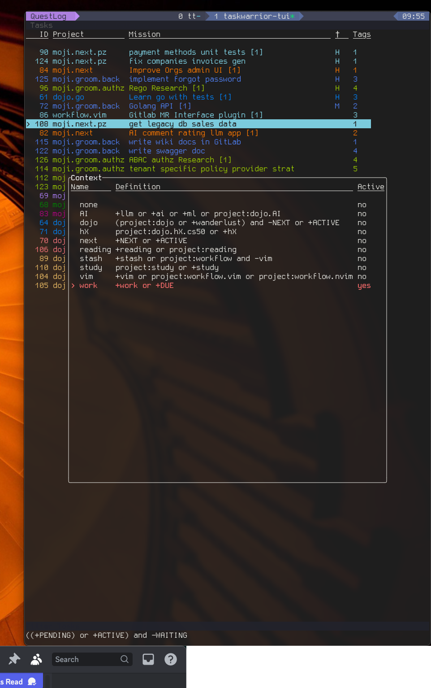
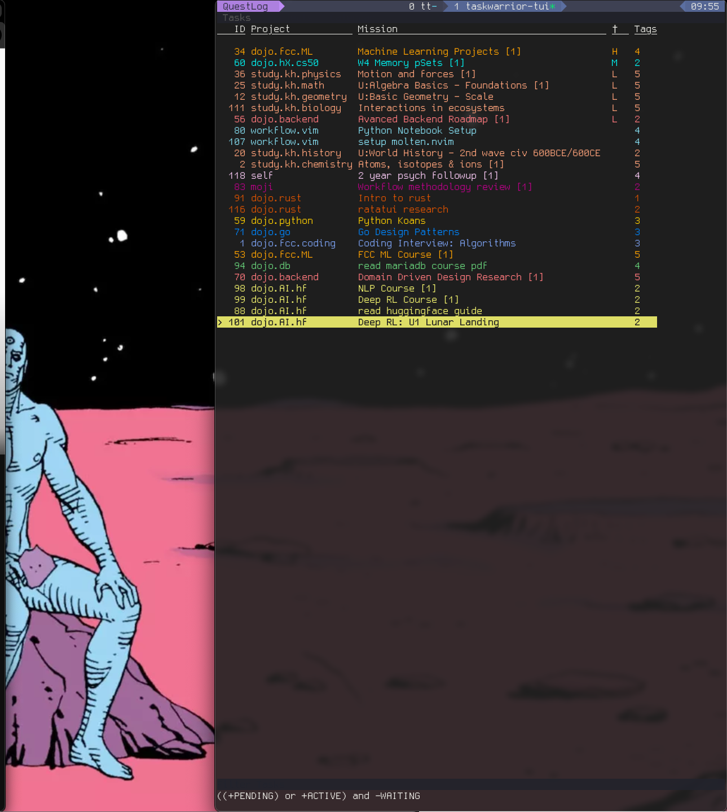
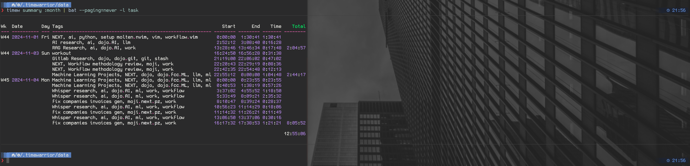
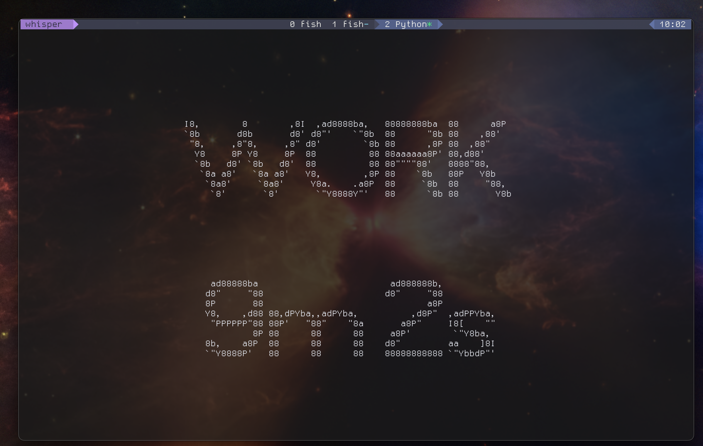
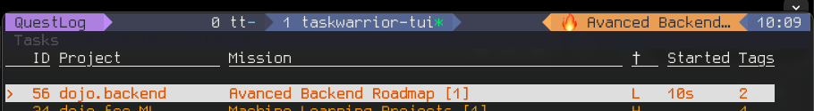

# Mon setup taskwarrior (par Hezirel)

## Associer des notes a une tâche

- Un script bash

```bash
if [ $# -eq 1 ]; then
    task_id=$1
    uuid=$(task _get $task_id.uuid)
    notes_file=~/dev/notes/tasknotes/$uuid.md
    if [ -f $TASKN/$uuid.md ]; then
        nvim $TASKN/$uuid.md
    else
        desc=$(task $task_id info | awk '/^Description/ {print substr($0, index($0,$2))}')
        annotation="Notes"
        task $task_id annotate -- $annotation
        {
            echo "p:$(task _get $task_id.project)"
            echo "d:$(task _get $task_id.description)"
            echo "#uuid:$uuid"
            echo "---"
            echo ""
        } >> $notes_file
        nvim $notes_file
    fi
fi
```
Insertion de meta data format custom en header du fichier à l'aide des helper commands pour taskwarrior
Facilement personalisable avec du FZF et du scripting pour avoir un picker multi notes éventuellement.
J'avais pensé à en faire un mais j'en ai jamais eu besoin au final

Le setup dans la config .taskrc

```
uda.taskwarrior-tui.shortcuts.8=$HOME/.config/.task/taskopen/scripts/addnote
```

## Les contextes

Les reports sont super bien en cli, mais sur tw-tui les contextes sonts rois

Voici une comparaison de syntaxe

```
	## Report: Path ##
report.path.labels=ID,Project,scheduled.countdown,Due,until.remaining,Mission
report.path.sort=start+,id+,due+,priority-,totalactivetime-
report.path.filter=(+BLOCKING -BLOCKED) or (project:dojo -COMPLETED -wanderlust -reading -BLOCKED -BLOCKING)
report.path.project=indented
report.path.columns=id,project,scheduled.countdown,due.relative,until.remaining,description.count
report.path.description=Main Quest - Storyline blocking tasks

```

```
context.next.read=+NEXT or +ACTIVE
context.next.write=+NEXT
context.work.read=+work or +DUE
context.work.write=+work
context.AI.read=+llm or +ai or +ml or project:dojo.AI
context.AI.write=+ai
context.hX.read=project:dojo.hX.cs50 or +hX
context.hX.write=project:dojo.hX.cs50 or +hX
context.dojo.read=(project:dojo or +wanderlust) and -NEXT or +ACTIVE
context.dojo.write=+wanderlust +dojo
context.study.read=project:study or +study
context.study.write=project:study or +study
context.stash.read=+stash or project:workflow and -vim
context.stash.write=+stash
context.reading.read=+reading or project:reading
context.stash.write=+reading
context.vim.read=+vim or project:workflow.vim or project:workflow.nvim
context.vim.write=+vim
```




## Le time management

- un UDA

```
## Task active time ##
uda.totalactivetime.type=duration
uda.totalactivetime.label=Total active time
uda.totalactivetime.values=

```
Ÿ
Un hook timewarrior pour avoir des jolis rapports



### Le timer

Pour mesurer facilement des durées de tâchs j'ai plusieurs alias de ce type

```fish
abbr -a wrkt "timew track workout;termdown -T WRKT;timew stop"
```

- [termdown](https://github.com/trehn/termdown)



Faut que je recode ce timer moi même pour le beau jeu

### La tâche active

J'ai modifié le fichier de hook pour timewarrior

```python
#!/usr/bin/env python3

from __future__ import print_function

import json
import subprocess
import sys
import os

# Hook should extract all of the following for use as Timewarrior tags:
#   UUID
#   Project
#   Tags
#   Description
#   UDAs

try:
    input_stream = sys.stdin.buffer
except AttributeError:
    input_stream = sys.stdin

# Make no changes to the task, simply observe.
old = json.loads(input_stream.readline().decode("utf-8", errors="replace"))
new = json.loads(input_stream.readline().decode("utf-8", errors="replace"))
print(json.dumps(new))


def extract_tags_from(json_obj):
    # Extract attributes for use as tags.
    tags = [json_obj['description']]

    if 'project' in json_obj:
        tags.append(json_obj['project'])

    if 'tags' in json_obj:
        tags.extend(json_obj['tags'])

    return tags


def extract_annotation_from(json_obj):

    if 'annotations' not in json_obj:
        return '\'\''

    return json_obj['annotations'][0]['description']

active_task_path = "/Users/ezirel/.cache/task.active"

start_or_stop = ''

# Started task.
if 'start' in new and 'start' not in old:
    start_or_stop = 'start'
    with open(active_task_path, 'w') as f:
        f.write(new['description'])

# Stopped task.
elif ('start' not in new or 'end' in new) and 'start' in old:
    start_or_stop = 'stop'
    if os.path.exists(active_task_path):
        os.remove(active_task_path)

if start_or_stop:
    tags = extract_tags_from(new)

    subprocess.call(['timew', start_or_stop] + tags + [':yes'])

# Modifications to task other than start/stop
elif 'start' in new and 'start' in old:
    old_tags = extract_tags_from(old)
    new_tags = extract_tags_from(new)

    if old_tags != new_tags:
        subprocess.call(['timew', 'untag', '@1'] + old_tags + [':yes'])
        subprocess.call(['timew', 'tag', '@1'] + new_tags + [':yes'])

    old_annotation = extract_annotation_from(old)
    new_annotation = extract_annotation_from(new)

    if old_annotation != new_annotation:
        subprocess.call(['timew', 'annotate', '@1', new_annotation])

```

La partie importante

```python
active_task_path = "/Users/ezirel/.cache/task.active"

start_or_stop = ''

# Started task.
if 'start' in new and 'start' not in old:
    start_or_stop = 'start'
    with open(active_task_path, 'w') as f:
        f.write(new['description'])

# Stopped task.
elif ('start' not in new or 'end' in new) and 'start' in old:
    start_or_stop = 'stop'
    if os.path.exists(active_task_path):
        os.remove(active_task_path)

```

Qui me permet ensuite de faire des segments de powerline custom pour tmux ou starship

```
[custom.task]
symbol = "🔥"
style = 'bold black'
when = 'test -e ~/.cache/task.active'
command = 'cat ~/.cache/task.active'
format = '[[░▒▓](#ffd700)[$symbol $output](fg:#000000 bg:#ffd700)[▓▒░](fg:#ffd700 bg:#1d2230)]($style)'
```


